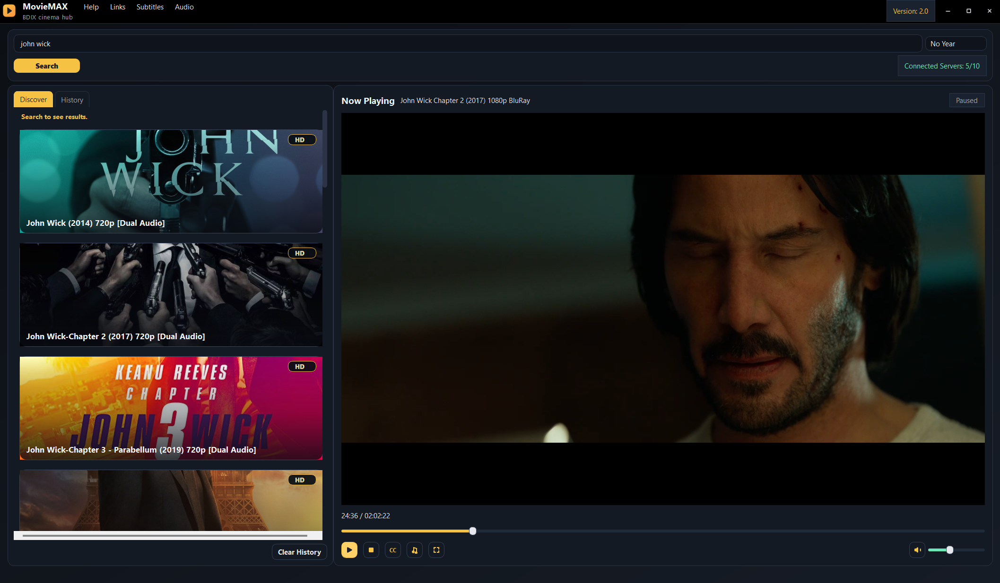

# MovieMAX

MovieMAX helps you find movies by connecting to multiple servers. 

## Features

- Search movies from connected servers
- In app streaming

## Download / Releases

All `.exe` and `.apk` files are published in GitHub Releases:

- Releases page: https://github.com/abdullahal-baki/movie-max/releases/

### Release assets (what to upload)

- Windows (Desktop): `MovieMAX-Setup-<desktop-version>.exe` (example: `MovieMAX-Setup-2.0.0.exe`)
- Android (Mobile): `MovieMAX-Mobile-<mobile-version>.apk` (recommended) **or** `MovieMAX-Mobile.apk`

Very simple release notes/template: `RELEASE_NOTES.md`

## Source Code

- Desktop repo: https://github.com/abdullahal-baki/Movie-Max-Project
- Mobile repo: https://github.com/abdullahal-baki/MovieMAX-mobile-version

## Community

- Official Channel: https://t.me/BakiSoftLabs
- Chat Group: https://t.me/BakiSoftLabschat

## Screenshots

### Desktop

  
  

### Mobile

  
  
  

