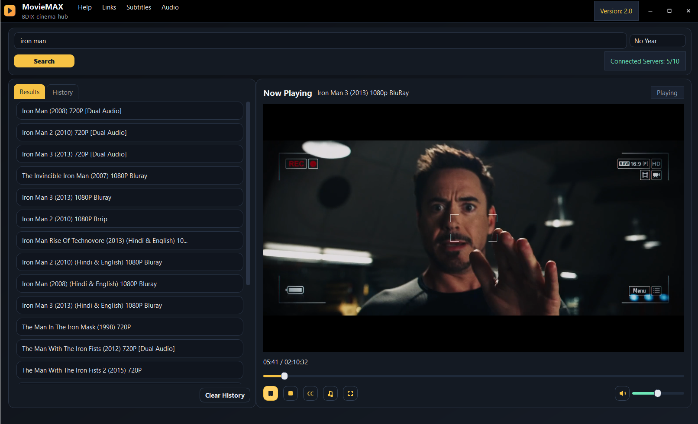
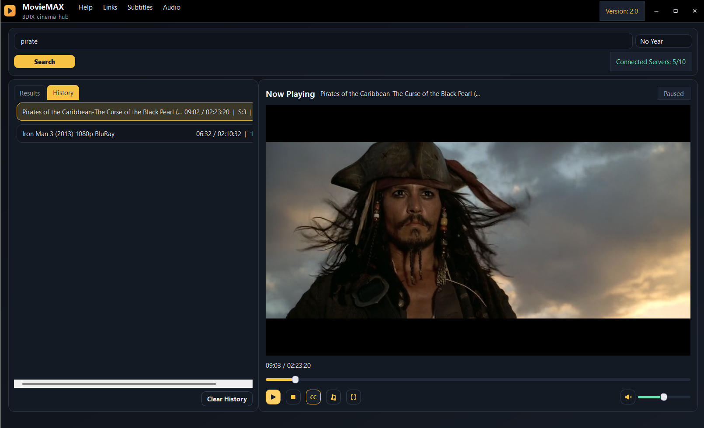

# MovieMAX

MovieMAX is the best software for finding movies. This software connect with several servers. Then find your movies from those servers. 
You can Stream the movie by VLC Media Player and also you can download movies.
Make sure at least one servers connected with your connection.

Official Channel: https://t.me/BakiSoftLabs  
Chat Group: https://t.me/BakiSoftLabschat

### Check Release 
or 
Download Link: [MovieMAX](https://github.com/abdullahal-baki/movie-max/releases/)

## Desktop Version
Source Repo: https://github.com/abdullahal-baki/Movie-Max-Project

## Mobile Version
Source Repo: https://github.com/abdullahal-baki/MovieMAX-mobile-version

---

---

---

